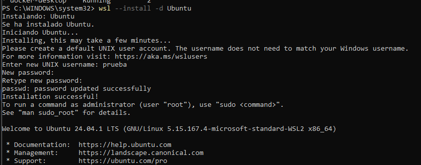
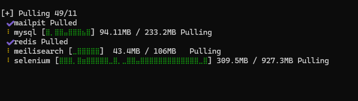
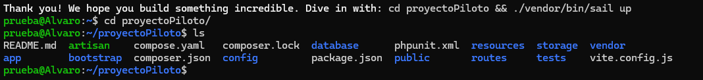
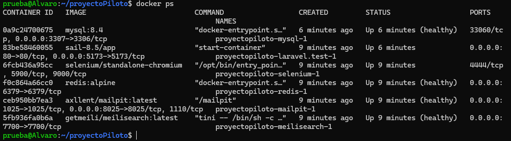
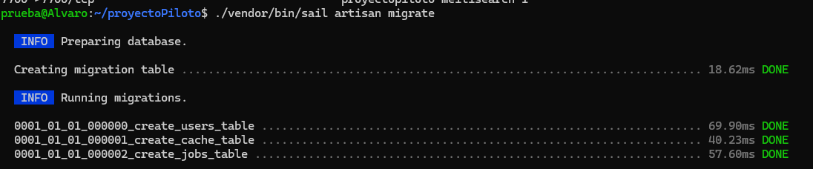
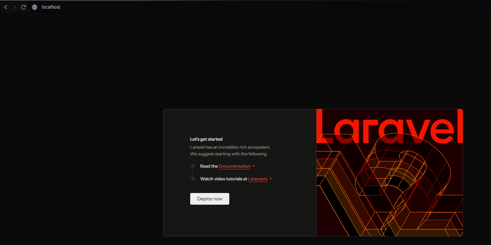
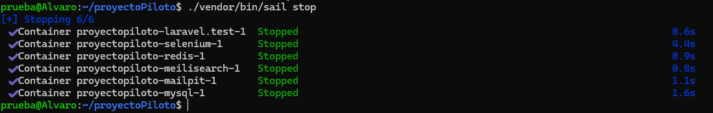
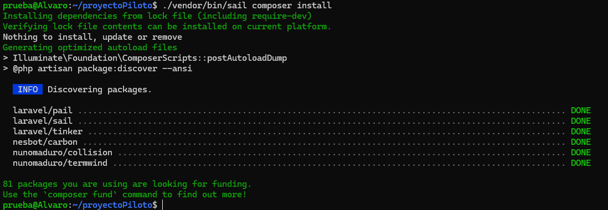
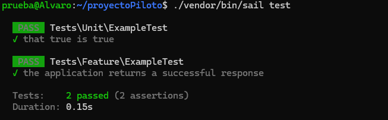

# Laravel_Sail
Proyecto de Laravel realizado desde Docker, utilizando Laravel Sail


# Índice


---

## 1.Requisitos Previos

Previamente deberemos tener Docker Desktop ejecutandose, WSL, al usar Windows y una terminal de comandos, en mi caso PowerShell.

Una vez tenemos todo esto, comenzaremos por la creación de nuestro proyecto.

Antes que nada, tenemos que instalar una distribución a nuestro subsistema de Linux, si previamente no lo teníamos (como es mi caso). En Powershell 
ejecutamos el siguiente comando :

```bash
   wsl --install -d Ubuntu
```

Luego nos pedirá usuario y contraseña, y tendremos Ubuntu instalado :




## 2.Creación del Scaffolding

Para crear la estructura del proyecto deberemos entrar a la terminal de WSL y escribir el siguiente comando :

```bash
   curl -s "https://laravel.build/proyectoPiloto" | bash
```

Una vez ejecutado este comando nos aparecerá lo siguiente por consola:



Cuando ha finalizado, nos creará una carpeta con el proyecto ya iniciado, esperando a ser desplegado :



## 3.Configuración de Laravel Sail

Una vez creado nuestro proyecto, ejecutaremos los siguientes comandos para desplegar nuestro proyecto :

```bash
   cd proyectoPiloto
   ./vendor/bin/sail up -d
```

Nota : Añadí la variable FORWARD_DB_PORT=3307 en el archivo .env ya que MySQL de Windows estaba utilizando el puerto 3306.

Al ejecutar el comando "up", comenzarán a ejecutarse los contenedores Docker :


## 4.Verificación de Contenedores

Para comprobar que los contenedores se están ejecutando correctamente el siguiente comando de Docker :

```bash
   docker ps
```

Lo que nos dará la siguiente salida :



## 5.Migraciones y Pruebas

Para ejecutar las migraciones de la BBDD ejecutaremos la siguiente instrucción :

```bash
   ./vendor/bin/sail artisan migrate
```

Si todo ha ido bien, obtendremos la siguiente salida :



### 5.1 Prueba en el Navegador

Para comprobar que el despliegue ha sido correcto, accederemos al localhost, teniendo esta web por defecto :



## 6. Comandos de Mantenimiento

Para gestionar el entorno, veremos los siguientes comandos :

- ./vendor/bin/sail stop : Sirve para detener los contenedores.

    Prueba de Salida :
    

- ./vendor/bin/sail up -d : Sirve para iniciar los contenedores.

    La prueba de Salida la vemos en #3.configuración de Laravel Sail

- ./vendor/bin/sail composer install : Se utiliza para ejecutar comandos de componser.

    Prueba de Salida:
    

- ./vendor/bin/sail test : Ejecuta las pruebas unitarias y de integración.

    Prueba de Salida:
    

## 7. PodMan
Aunque en esta práctica se ha utilizado Docker Desktop, el entorno es compatible con Podman.